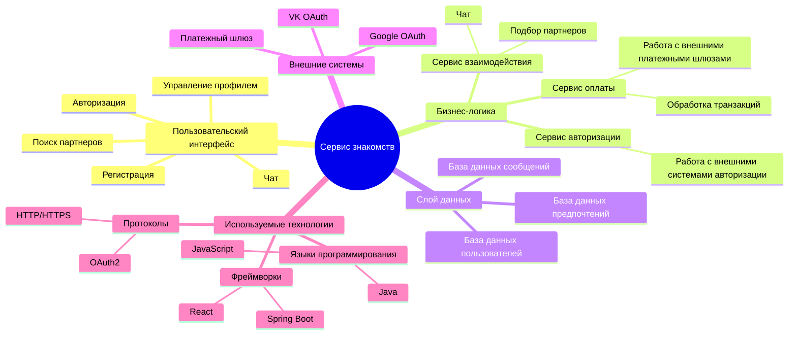
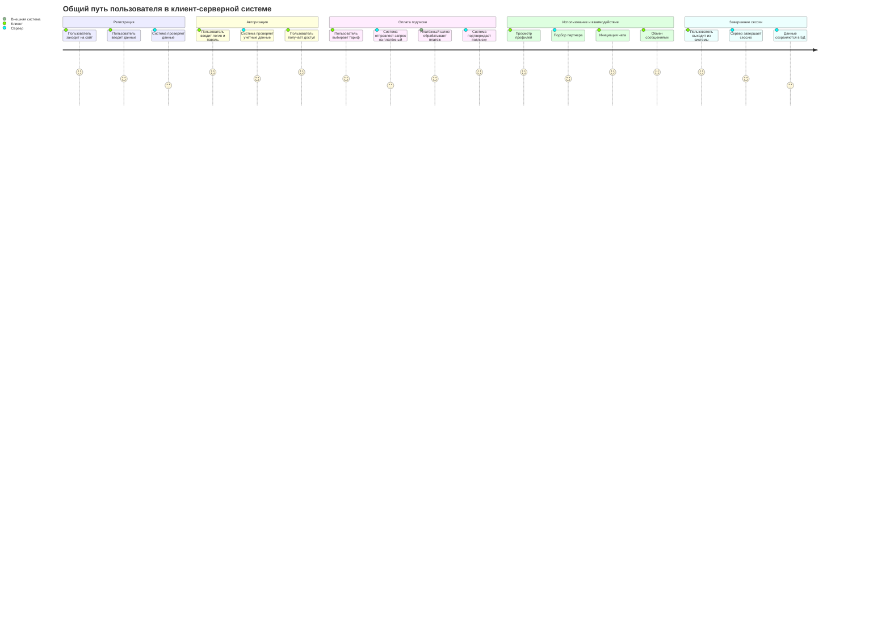
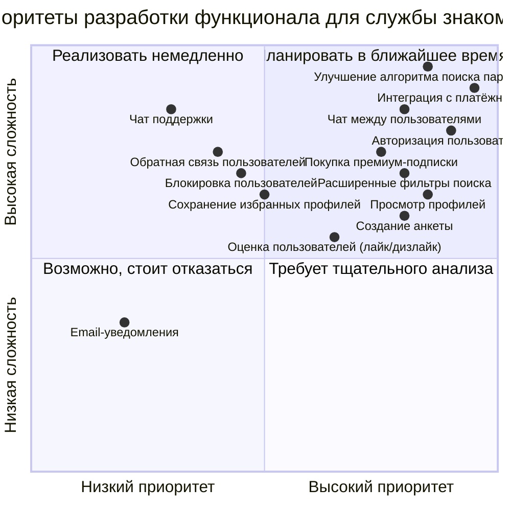
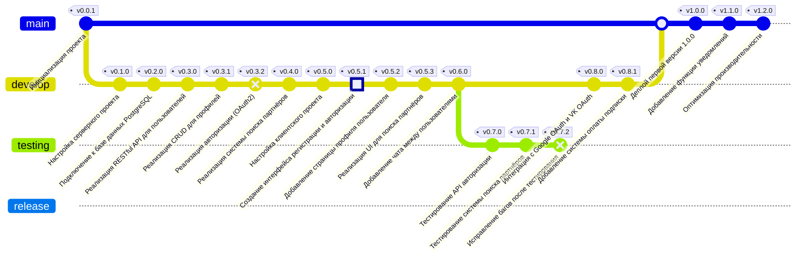

Сервис знакомств предоставляет пользователям возможность регистрации, авторизации, поиска партнеров, общения через чат и управления профилем. Архитектура системы построена на микросервисах с использованием современных технологий, что обеспечивает масштабируемость, безопасность и интеграцию с внешними сервисами, такими как Google OAuth, VK OAuth и платежные шлюзы. Система ориентирована на удобство взаимодействия пользователей, эффективное управление данными и поддержку высоких нагрузок.

Диаграмма пути пользователя описывает основные этапы взаимодействия пользователя с системой, начиная с регистрации и авторизации до завершения сессии. Отражены ключевые процессы, такие как оплата подписки, подбор партнера, использование чата и обмен сообщениями, с учетом взаимодействий между клиентом, сервером и внешними системами. Это помогает визуализировать последовательность действий и определить зоны для оптимизации.

Диаграмма приоритетов функционала помогает оценить задачи по их важности и сложности, предоставляя визуальное представление о стратегических решениях в разработке. Она распределяет функции, такие как улучшение алгоритмов, чат между пользователями и интеграция с платёжной системой, по категориям: от немедленной реализации до возможного отказа. Это помогает расставить акценты на ключевых задачах для службы знакомств.

Диаграмма Git отражает развитие системы службы знакомств через коммиты, начиная с инициализации проекта и заканчивая деплоем версии 1.2.0. Она показывает эволюцию ключевых функций, таких как реализация CRUD для профилей, интеграция с OAuth2 и Google/VK авторизацией, а также добавление системы подписки. Ветвление и тестирование обеспечивают контроль качества, а релизы фиксируют завершенные этапы разработки.

