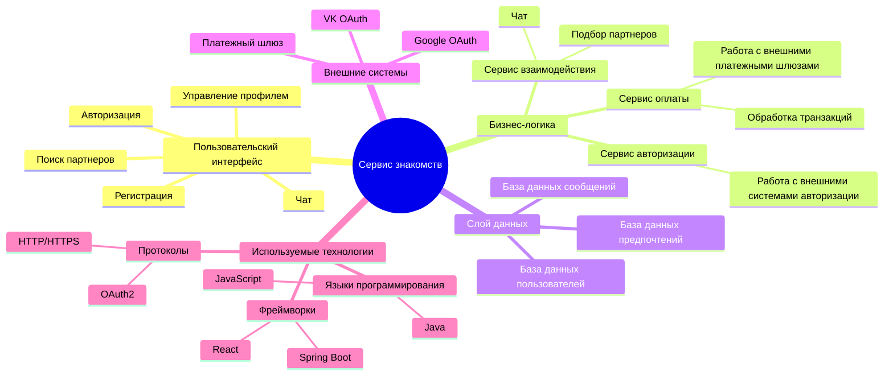
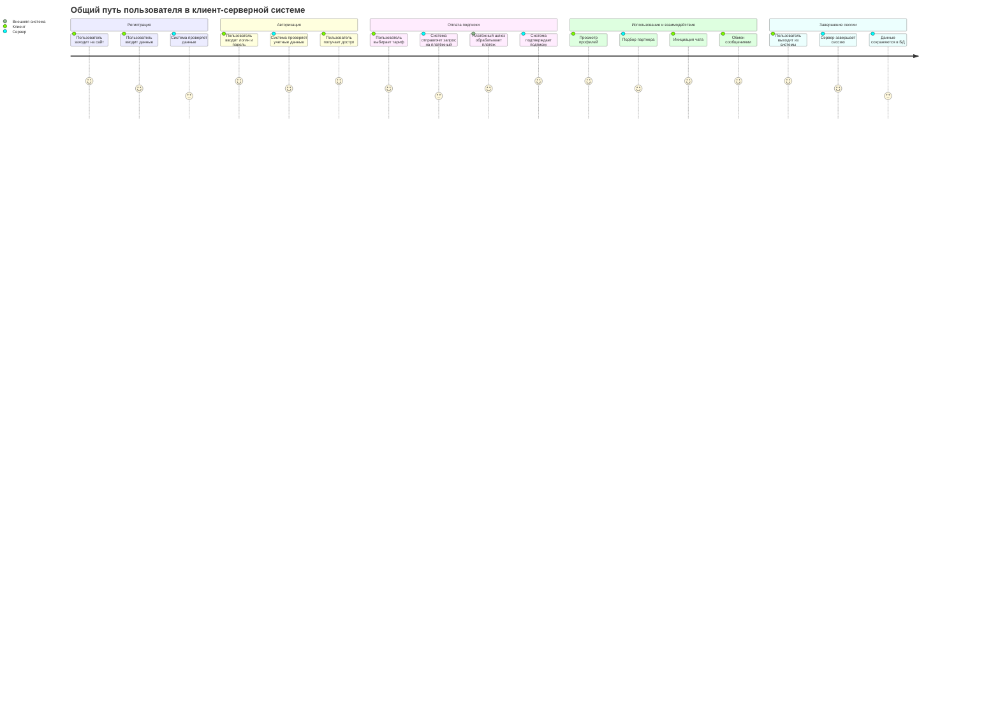

Сервис знакомств предоставляет пользователям возможность регистрации, авторизации, поиска партнеров, общения через чат и управления профилем. Архитектура системы построена на микросервисах с использованием современных технологий, что обеспечивает масштабируемость, безопасность и интеграцию с внешними сервисами, такими как Google OAuth, VK OAuth и платежные шлюзы. Система ориентирована на удобство взаимодействия пользователей, эффективное управление данными и поддержку высоких нагрузок.

Диаграмма пути пользователя описывает основные этапы взаимодействия пользователя с системой, начиная с регистрации и авторизации до завершения сессии. Отражены ключевые процессы, такие как оплата подписки, подбор партнера, использование чата и обмен сообщениями, с учетом взаимодействий между клиентом, сервером и внешними системами. Это помогает визуализировать последовательность действий и определить зоны для оптимизации.

